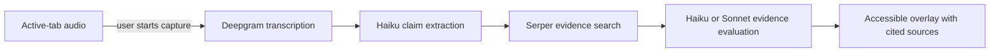

# InTruth

InTruth is a Chrome extension that detects check-worthy claims in supported videos and verifies them against current web evidence while the video is playing.

This fork is an evidence-first reliability release. A detected claim is shown as **checking**, never as a factual verdict. It becomes `TRUE`, `SUBSTANTIALLY TRUE`, `FALSE`, or `MISLEADING` only after the evidence pass completes. Missing, conflicting, or failed evidence produces an explicit `UNVERIFIABLE` or error state instead of silently preserving a model guess.

> InTruth is an assistive research tool, not an authority. Transcription, retrieval, and language models can all be wrong. Read the cited sources before relying on a result, especially for medical, legal, financial, electoral, or safety-sensitive decisions.

## How it works



The extension uses immutable session and claim IDs so late network responses cannot update another session. Web snippets and transcripts are treated as untrusted data, model output is schema-validated, and every claim receives a terminal state.

## Current scope

- Chrome 116 or later using Manifest V3
- YouTube and Jubilee pages listed in [`manifest.json`](realtime-factcheck/manifest.json)
- Bring your own Anthropic, Deepgram, and Serper API keys
- Live transcript, speaker labels, check-worthy claim detection, evidence-linked verdicts, local HTML report export, and visible per-session usage estimates
- No developer-operated relay server and no analytics or telemetry

The language selector controls transcription. `Auto · multilingual` uses Deepgram Nova-3 multilingual streaming; selecting a specific language can improve accuracy for single-language content. Retrieval quality, speaker diarization, and model accuracy vary by language, audio quality, topic, and provider support.

## Quality and cost controls

The default **Efficient** profile uses Claude Haiku 4.5 for both candidate extraction and evidence evaluation. **Balanced** still uses Haiku for the high-volume extraction stage and reserves Claude Sonnet 5 for claims that already have usable search evidence. The extension never needs Sonnet merely to decide that a transcript window contains no check-worthy claim.

Transcript windows are batched adaptively, recent context is bounded, and duplicate claim text is handled locally rather than sent back to the model. The overlay reports analyzed windows, detected claims, Anthropic requests, and an estimated Anthropic cost. A configurable `$0.25`, `$0.50`, or `$1.00` session guard pauses new AI analysis at the limit while leaving the transcript active. Estimates use versioned public token prices and may differ from the provider invoice; Deepgram and Serper charges are separate.

Prompt caching is not forced. Haiku 4.5 currently requires a stable prefix of at least 4,096 tokens, much longer than InTruth's compact extraction prompt, so padding requests merely to qualify would waste tokens. Anthropic's asynchronous Batch API is likewise unsuitable for live verdicts.

## Install the unpacked extension

Requirements: Node.js 20+ for the build checks and valid API credentials for [Anthropic](https://www.anthropic.com/), [Deepgram](https://deepgram.com/), and [Serper](https://serper.dev/).

```bash
npm run ci
```

Then:

1. Open `chrome://extensions`.
2. Enable **Developer mode**.
3. Select **Load unpacked**.
4. Choose the generated `dist/intruth` directory.
5. Open a supported video page, open InTruth, enter the three provider keys, review the data disclosure, and grant consent.
6. Select the transcript language, analysis profile, and session budget, then start the session.

The checked-in extension is also directly loadable from `realtime-factcheck`, but `dist/intruth` is the validated release artifact.

## Data and credentials

InTruth stores provider keys, language and analysis preferences, the session-budget preference, and consent locally in Chrome extension storage. Access is restricted to trusted extension contexts, so supported webpages cannot read those values through the content script. Chrome storage is not a hardware-backed secret vault; anyone with sufficient access to the browser profile or device may still recover it.

During an active session:

- tab audio is sent to Deepgram for transcription;
- transcript context and extracted evidence are sent to Anthropic for claim extraction and evaluation;
- claim-derived search queries are sent to Serper;
- cited results remain in the page overlay until it is removed, and a report is downloaded only on user request.

Chrome's memory-backed session storage temporarily keeps a bounded recovery/outbox record and aggregate token/cost counters for the active session. It may contain pending claims, short transcript source quotes, experimental lexical markers, and undelivered cited results; it is restricted to trusted extension contexts and cleared during normal stop or failed-start cleanup. See [`PRIVACY.md`](PRIVACY.md) for exact retention and failure-case details.

The project developer does not receive these requests. Provider retention and training rules depend on the user's own provider accounts and agreements. See [`PRIVACY.md`](PRIVACY.md) for the full disclosure and deletion controls.

## Reliability boundaries

InTruth deliberately abstains when it cannot support a categorical result. Even a cited verdict can be wrong because a transcript may contain an incorrect name, number, or negation; a search snippet may omit crucial context; a source may be stale or unreliable; or a model may misunderstand the evidence.

Speaker delivery markers are experimental descriptive signals only. They do **not** measure truthfulness, deception, intent, or character and are kept separate from the factual verdict.

## Development

The repository has no runtime package dependencies. The tooling validates manifest and HTML references, rejects embedded provider credentials, checks JavaScript syntax, runs unit tests, and builds the unpacked artifact.

```bash
npm run lint       # parse every JavaScript file
npm run validate   # verify extension references and secret hygiene
npm test           # unit and repository smoke tests
npm run build      # create dist/intruth
npm run ci         # run the complete local CI sequence
```

Project layout:

```text
realtime-factcheck/
├── manifest.json
├── assets/
└── src/
    ├── background/   # session orchestration, claim extraction, evidence grounding
    ├── content/      # overlay, report export, optional delivery markers
    ├── offscreen/    # tab audio and Deepgram WebSocket lifecycle
    └── popup/        # configuration, consent, and capture controls
scripts/              # dependency-free validation and build tooling
tests/                # Node test suite
```

Read [`CONTRIBUTING.md`](CONTRIBUTING.md), [`SECURITY.md`](SECURITY.md), and [`docs/ARCHITECTURE.md`](docs/ARCHITECTURE.md) before changing data flow or verdict semantics.

## License and attribution

Copyright © 2024 Risha Panigrahi. Use is governed by the repository's [non-commercial license](LICENSE). This fork credits and links to the [original InTruth repository](https://github.com/rpanigrahi222/intruth-factcheck); commercial use requires the original author's explicit written permission.
