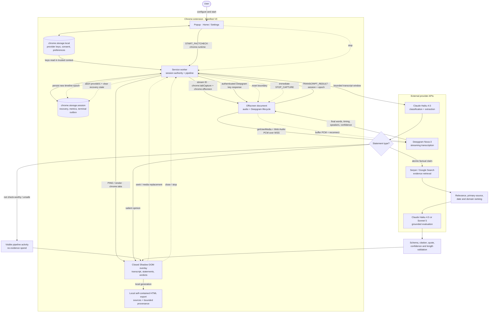
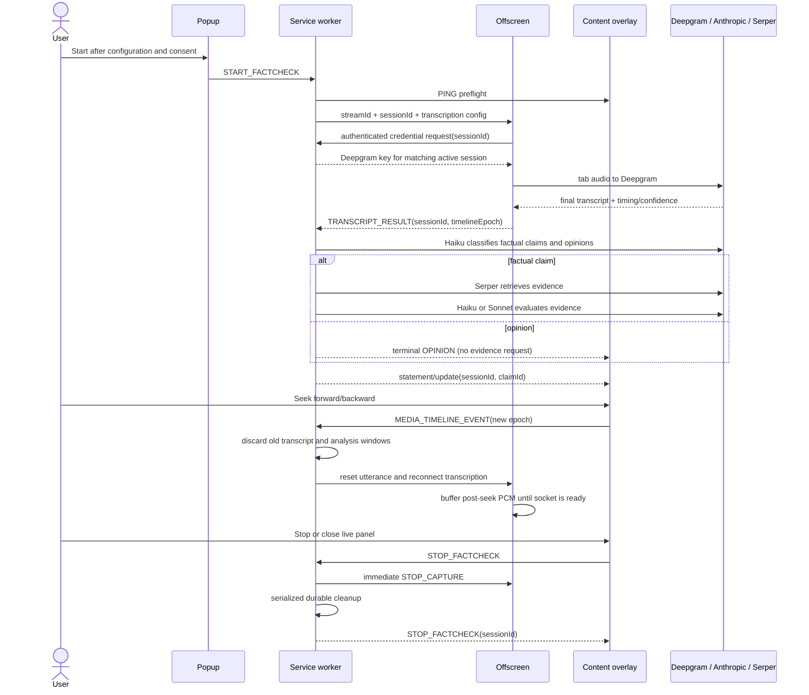

# Architecture and invariants

InTruth separates browser privileges and provider responsibilities across four Manifest V3 contexts.

## End-to-end workflow and tools

Solid arrows carry normal data or analysis. Dashed arrows are lifecycle controls for seek, recovery, and stop.

## Context ownership

- **Popup:** provider configuration, language, Efficient/Balanced routing, Anthropic session budget, consent, URL readiness, and user controls. It never sends keys through the page.
- **Service worker:** authoritative session state, transcript sequencing, claim extraction, retrieval, validation, and routing.
- **Offscreen document:** tab audio stream and Deepgram WebSocket. Chrome exposes only `chrome.runtime` in this context, so it requests its credential from the worker after sender/session validation and never reads extension storage. It has no claim or verdict logic.
- **Content overlay:** display and local report export inside a closed Shadow DOM. It never receives provider credentials, and reports itself unhealthy if its stylesheet, host visibility, or DOM attachment is compromised.

## Safety invariants

1. No audio capture begins until the supported page answers the preflight message.
2. Startup is transactional: every partial resource is cleaned up on failure.
3. Every asynchronous event carries a session ID; every candidate claim carries a claim ID.
4. A stale session may not mutate UI or current state.
5. Statement extraction never emits a categorical truth verdict. Opinions become terminal `OPINION` results and never enter evidence retrieval.
6. Every displayed candidate reaches a terminal state: grounded result, unverifiable, or explicit error.
7. A categorical result requires usable retrieved evidence and citation IDs that map to displayed source metadata.
8. Provider errors, empty retrieval, malformed model output, and low-confidence input fail closed.
9. Transcript, page context, snippets, and provider output are untrusted data, not instructions.
10. Delivery markers are informational experiments and never feed the factual verdict.
11. Clicking stop disables new Anthropic and Serper work before the transcription tail is drained for display.
12. A hidden, detached, or unresponsive overlay is fatal to capture; both the content script and worker watchdog request teardown.
13. Haiku handles every high-volume extraction request; Sonnet is used only for evidence verification in the user-selected Balanced profile.
14. Provider-reported token usage is accumulated per stage. Reaching the configured Anthropic cost estimate pauses new AI/search work without hiding or stopping the live transcript.
15. Provider keys never enter content-tab messages or persisted session state. The offscreen document receives only its Deepgram credential in a direct response bound to the active session.
16. Every post-seek transcript, analysis batch, claim, and verdict carries the current timeline epoch; asynchronous output from an older epoch is discarded before it can create a new card.
17. Deepgram KeepAlive messages preserve an intentionally silent connection but do not count as audio health. A separate no-PCM/persistent-mute watchdog rebuilds a stalled tab capture when playback is active.
18. Stop preempts any capture start or reconnect before it waits for the serialized session cleanup, and a lost stop response is reconciled against authoritative worker status.

## Adaptive analysis pipeline

Final transcript fragments are buffered until six utterances, about 60 Unicode tokens, or an idle deadline. Very small conversational fragments wait for a bounded 12-second maximum instead of causing a paid request after every pause or speaker turn. Each extraction receives at most four preceding context utterances and never receives the full list of claims already emitted; invariant-aware Unicode deduplication stays local for the whole session.

Efficient mode routes classification/extraction and grounded evaluation to pinned Claude Haiku 4.5. Balanced mode still classifies with Haiku but routes only evidence-bearing factual claims to Claude Sonnet 5. Salient opinions become local terminal results after classification and incur neither a Serper request nor a verdict-model call. Low-ASR claims and claims with no usable search evidence become `UNVERIFIABLE` without a verdict-model call. Anthropic network timeouts are not retried automatically because a timed-out request may already have been accepted and billed.

The worker records provider-reported input, output, cache-write, and cache-read token categories. It estimates cost using prices versioned with the extension and exposes both the estimate and raw counters to the overlay. The number is a safety control, not an invoice; provider dashboards are authoritative.

## Extension lifecycle

Manifest V3 can stop and recreate the service worker at any time. A bounded active-session recovery record is therefore kept in memory-backed `chrome.storage.session`; it includes capture identity, pending claim provenance, and terminal results not yet delivered to the overlay. The worker persists a terminal outbox entry before sending it, retries delivery, replays undelivered entries after restart, and converts genuinely interrupted `CHECKING` work to an explicit error. Durable configuration stays in `chrome.storage.local`. Both storage areas are restricted to trusted extension contexts. Runtime global variables are caches, not the sole source of truth.

Stop attempts cleanup even when cached state is incomplete. It first disables analysis and sends an immediate offscreen stop so a capture refresh cannot hold the UI open. Serialized cleanup then aborts provider work, closes the transcription stream, stops media tracks, releases the document, and clears persisted session state. A new start creates a new session generation and invalidates late responses from prior work.

## Evidence contract

Retrieved evidence is ranked by claim overlap, primary-source authority, Serper position, and availability at the video's date before duplicate publisher domains are collapsed. It is then assigned stable IDs before evaluation. The model may cite only those IDs. Parsed output must use an allowed verdict, bounded confidence, an explanation of at most 240 characters, and no more than three valid evidence IDs. Quotes must occur exactly in the cited snippet, and snippet-only categorical results cannot exceed `MEDIUM` confidence. Validated citations can remain attached to an `UNVERIFIABLE` result so the reviewed evidence is auditable. The overlay receives metadata only for sources actually cited by the accepted result.

This contract improves traceability but does not prove that a source entails the verdict. Future work should retrieve full documents, validate authority and publication dates from those documents, preserve exact full-document evidence spans, and measure citation entailment on a maintained benchmark.
