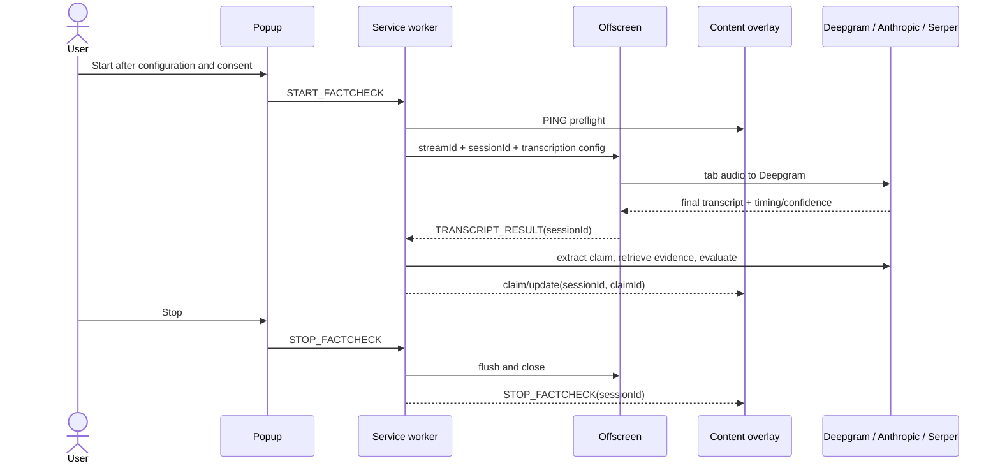

# Architecture and invariants

InTruth separates browser privileges and provider responsibilities across four Manifest V3 contexts.

## Context ownership

- **Popup:** provider configuration, consent, URL readiness, and user controls. It never sends keys through the page.
- **Service worker:** authoritative session state, transcript sequencing, claim extraction, retrieval, validation, and routing.
- **Offscreen document:** tab audio stream and Deepgram WebSocket. It has no claim or verdict logic.
- **Content overlay:** display and local report export inside a closed Shadow DOM. It never receives provider credentials, and reports itself unhealthy if its stylesheet, host visibility, or DOM attachment is compromised.

## Safety invariants

1. No audio capture begins until the supported page answers the preflight message.
2. Startup is transactional: every partial resource is cleaned up on failure.
3. Every asynchronous event carries a session ID; every candidate claim carries a claim ID.
4. A stale session may not mutate UI or current state.
5. Candidate extraction never emits a categorical truth verdict.
6. Every displayed candidate reaches a terminal state: grounded result, unverifiable, or explicit error.
7. A categorical result requires usable retrieved evidence and citation IDs that map to displayed source metadata.
8. Provider errors, empty retrieval, malformed model output, and low-confidence input fail closed.
9. Transcript, page context, snippets, and provider output are untrusted data, not instructions.
10. Delivery markers are informational experiments and never feed the factual verdict.
11. Clicking stop disables new Anthropic and Serper work before the transcription tail is drained for display.
12. A hidden, detached, or unresponsive overlay is fatal to capture; both the content script and worker watchdog request teardown.

## Extension lifecycle

Manifest V3 can stop and recreate the service worker at any time. A bounded active-session recovery record is therefore kept in memory-backed `chrome.storage.session`; it includes capture identity, pending claim provenance, and terminal results not yet delivered to the overlay. The worker persists a terminal outbox entry before sending it, retries delivery, replays undelivered entries after restart, and converts genuinely interrupted `CHECKING` work to an explicit error. Durable configuration stays in `chrome.storage.local`. Both storage areas are restricted to trusted extension contexts. Runtime global variables are caches, not the sole source of truth.

Stop attempts cleanup even when cached state is incomplete. It first disables analysis and aborts in-flight provider requests, then asks the offscreen context to flush already-sent transcription audio for display only, closes the provider stream, stops media tracks, and releases the document. A new start creates a new session generation and invalidates late responses from prior work.

## Evidence contract

Retrieved evidence is assigned stable IDs before it is sent for evaluation. The model may cite only those IDs. Parsed output must use an allowed verdict, bounded confidence, an explanation, and an array of valid evidence IDs. Quotes must occur exactly in the cited snippet, duplicate publisher domains are collapsed, and snippet-only categorical results cannot exceed `MEDIUM` confidence. The overlay receives metadata only for sources actually cited by the accepted result.

This contract improves traceability but does not prove that a source entails the verdict. Future work should retrieve full documents, preserve exact evidence spans, rank source authority and freshness, and measure citation entailment on a maintained benchmark.
